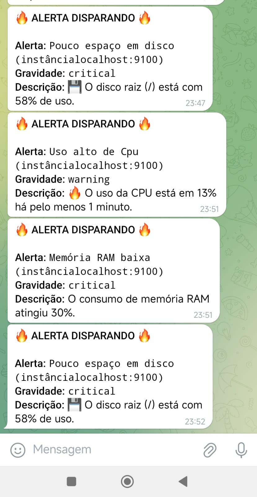
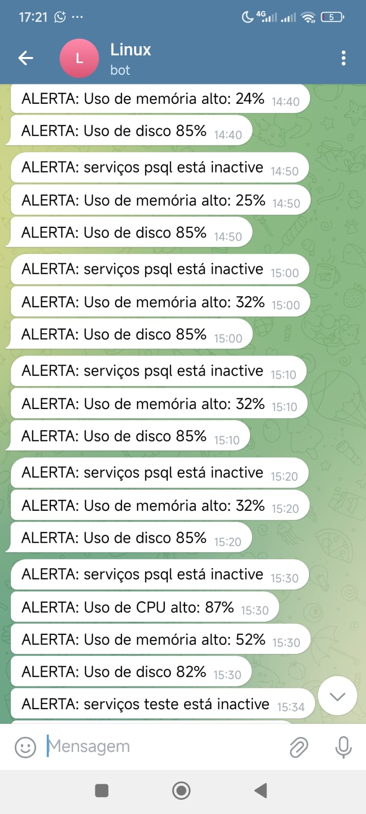

📊 Monitoramento de Servidor Linux
Este projeto demonstra a criação e evolução de uma solução de monitoramento para servidores Linux. O projeto começa com um script Bash simples para alertas básicos e evolui para uma stack completa e profissional utilizando Prometheus, Alertmanager e Grafana.

Stack de Tecnologias
Scripting: Bash

Coleta de Métricas: Prometheus, Node Exporter

Alertas: Alertmanager

Notificações: Telegram

Visualização: Grafana (em desenvolvimento)

Agendamento (v1): Cron

🚀 Como Rodar (Versão Recomendada: Prometheus Stack)
A forma recomendada de executar este projeto é utilizando a stack completa. As instruções detalhadas de instalação e configuração estão na seção "Evolução do Projeto".

Pré-requisitos: Servidor Linux, acesso sudo.

Instale os Componentes: Siga as Fases 1, 2, 3 e 4 da seção de evolução para instalar e configurar o Node Exporter, Prometheus e Alertmanager.

Execute os Serviços: Inicie os serviços em terminais separados para a operação interativa.

sudo -u node_exporter /usr/local/bin/node_exporter

./prometheus --config.file=prometheus.yml

./alertmanager --config.file=alertmanager.yml

Acesse as Interfaces:

Prometheus: http://IP_DO_SERVIDOR:9090

Alertmanager: http://IP_DO_SERVIDOR:9093

📖 A Evolução do Projeto
Esta seção documenta a jornada do projeto, desde a solução inicial até a arquitetura final.

Fase Inicial (v1): Monitoramento com Script Bash
A primeira versão do projeto consistiu em um script Bash (monitoramento.sh) para realizar checagens básicas e enviar alertas via Telegram.

Funcionalidades:

Monitoramento de Serviços: Verifica o status de serviços essenciais, configuráveis na variável SERVICOS=("nginx" "mysql") dentro do monitoramento.sh. Se um serviço listado parar, falhar ou for reiniciado, um alerta é imediatamente disparado para o Telegram.

Medição de Recursos: Acompanha o uso de CPU, Memória e Disco.

Geração de Logs: Cria um arquivo de log para registrar todos os eventos de alerta e a execução do script. O caminho do log é configurável através da variável LOG.

Envio de Alertas: Utiliza um segundo script (bot_telegram.sh) para enviar as notificações.

Execução: Agendada via cron para rodar periodicamente.

Limitações: Sem dados históricos, alertas "barulhentos" para picos rápidos, configuração fixa no código.

Estrutura do Projeto (v1)

monitoramento-linux/
├── monitoramento.sh        # Script principal
├── bot_telegram.sh         # Script que envia mensagens para o Telegram
├── .env                    # Arquivo com variáveis TOKEN e CHAT_ID
└── README.md

Como Usar (v1)

1. Dê permissão de execução:

chmod +x monitoramento.sh
chmod +x bot_telegram.sh

2. Configure o .env com as variáveis BOT_TOKEN e CHAT_ID. O script bot_telegram.sh foi configurado para ler este arquivo de forma segura.

3. Crie o diretório de Logs: O script precisa de um local para armazenar os logs. Antes de executar, certifique-se de que o diretório especificado na variável LOG do monitoramento.sh exista. Por exemplo, se LOG="/home/rafael/logs/monitoramento.log", crie a pasta logs:

mkdir -p /home/rafael/logs

4. Execução automática com cron (exemplo para cada 10 minutos):

Para que o script rode de forma autônoma e contínua, ele pode ser adicionado ao crontab do sistema.

# Abra o editor do crontab
sudo crontab -e

# Adicione a seguinte linha no final do arquivo para executar a cada 10 minutos
*/10 * * * * /caminho/completo/para/monitoramento.sh

Evolução para a Stack Profissional (v2)
Para superar as limitações do script, o projeto evoluiu para uma stack de monitoramento padrão da indústria.

Fase 1: Coleta de Dados com Node Exporter
O Node Exporter atua como um "sensor" no servidor, expondo centenas de métricas (CPU, memória, disco, etc.) de forma contínua para o Prometheus coletar.

1. Instalação:

# Baixar e descompactar o Node Exporter
wget https://github.com/prometheus/node_exporter/releases/download/v1.8.1/node_exporter-1.8.1.linux-amd64.tar.gz
tar xvfz node_exporter-1.8.1.linux-amd64.tar.gz
sudo mv node_exporter-1.8.1.linux-amd64/node_exporter /usr/local/bin/

2. Criação de Usuário de Serviço (Segurança):
Um usuário de sistema dedicado é criado para rodar o processo com privilégios mínimos.

sudo useradd --system --no-create-home --shell /bin/false node_exporter
sudo chown node_exporter:node_exporter /usr/local/bin/node_exporter

3. Verificação:
O Node Exporter expõe as métricas na porta 9100.

# Em um terminal, verifique as métricas
curl http://localhost:9100/metrics

Fase 2: Armazenamento e Processamento com Prometheus
O Prometheus Server é o "cérebro" da operação. Sua função é coletar (fazer scrape) as métricas e armazená-las para consultas e análises futuras.

Armazenamento Local com TSDB

Diferente de sistemas que exigem um banco de dados externo, o Prometheus possui um banco de dados de séries temporais (TSDB) altamente eficiente, embutido e que armazena os dados localmente no disco do servidor. Ele é otimizado para lidar com o grande volume de dados de métricas com carimbo de tempo. Por padrão, o Prometheus retém os dados por 15 dias, o que o torna ideal para análise de tendências recentes e depuração de incidentes, justificando a ideia de ser um armazenamento "temporário" para dados de curto e médio prazo.

1. Instalação:

# Baixar e descompactar o Prometheus
wget https://github.com/prometheus/prometheus/releases/download/v2.53.0/prometheus-2.53.0.linux-amd64.tar.gz
tar xvfz prometheus-2.53.0.linux-amd64.tar.gz
# A pasta criada será usada para a execução interativa.

2. Configuração (prometheus.yml):
Este arquivo define o que o Prometheus deve monitorar, onde encontrar as regras de alerta e para qual Alertmanager enviar as notificações.

global:
  scrape_interval: 15s

# Carrega os arquivos de regras de alerta.
rule_files:
  - "regras.yml"

# Configuração para se conectar ao Alertmanager.
alerting:
  alertmanagers:
    - static_configs:
      - targets: ['localhost:9093']

# Configuração dos alvos a serem monitorados.
scrape_configs:
  - job_name: "prometheus"
    static_configs:
      - targets: ["localhost:9090"]

  - job_name: "node_exporter"
    static_configs:
      - targets: ["localhost:9100"]

3. Visualizando as Métricas Coletadas

Na interface do Prometheus (Gráfico), é possível consultar e visualizar em tempo real qualquer uma das centenas de métricas coletadas pelo Node Exporter, provando que a coleta de dados está funcionando corretamente.

4. Escalando o Monitoramento para Múltiplos Servidores

Uma das grandes vantagens do Prometheus é a capacidade de centralizar o monitoramento de múltiplos servidores. Para isso, basta adicionar novos alvos (targets) ao job do node_exporter.

Pré-requisito: O Node Exporter deve estar instalado e em execução em cada novo servidor que você deseja monitorar.

Exemplo de configuração no prometheus.yml:

Basta adicionar o endereço IP e a porta de cada novo servidor à lista targets.

scrape_configs:
  # ... (outros jobs)

  - job_name: "node_exporter"
    static_configs:
      - targets:
          - "IP_DO_SERVIDOR_1:9100" # Servidor local ou primeiro servidor
          - "IP_DO_SERVIDOR_2:9100" # Servidor de banco de dados
          - "IP_DO_SERVIDOR_3:9100" # Servidor web

Após reiniciar o Prometheus, ele começará a coletar métricas de todos os servidores listados.

Fase 3: Definição de Alertas (Regras)
Nesta fase, ensinamos o Prometheus a ser proativo. A base da lógica de monitoramento (verificar CPU, RAM e disco) é a mesma do script Bash, mas agora é implementada de forma muito mais poderosa e resiliente através de regras de alerta, definidas em um arquivo regras.yml.

1. Entendendo a Estrutura das Regras

Cada regra no arquivo é composta por chaves que trazem vantagens significativas sobre um simples if/then:

expr: A expressão em linguagem PromQL que define a condição do alerta. É o "coração" da regra.

for: 5m: Esta é uma das maiores vantagens. O Prometheus só irá disparar o alerta se a condição em expr for continuamente verdadeira por 5 minutos. Isso evita alarmes falsos para picos de uso rápidos e momentâneos, um problema comum em scripts simples.

labels: Permite adicionar etiquetas customizadas, como a severidade (severity: critical), que podem ser usadas pelo Alertmanager para rotear notificações para diferentes canais.

annotations: Onde definimos a mensagem do alerta.

summary: Um título curto para o alerta.

description: O corpo da mensagem. Note o uso de {{ $value | printf "%.2f" }}: isso permite que a mensagem seja dinâmica, incluindo o valor exato que causou o disparo do alerta, fornecendo um contexto muito mais rico.

2. Arquivo de Regras (regras.yml)

groups:
  - name: AlertaServidor
    rules:
      # Regra para monitorar o alto uso da CPU.
      - alert:  AutoCargaDeCPU
        expr: 100 - (avg by (instance) (rate(node_cpu_seconds_total{mode="idle"}[2m])) * 100) > 1
        for: 1m
        labels:
          severity: warning
        annotations:
          summary: "Uso alto de Cpu (instância{{ $labels.instance }})"
          description: "🔥 O uso da CPU está em {{ $value | printf \"%.0f\" }}% há pelo menos 1 minuto."

      # Regra para monitorar o alto consumo de memória RAM.
      - alert:  ConsumoALtodeMemoria
        expr: (node_memory_MemAvailable_bytes / node_memory_MemTotal_bytes) * 100 < 90
        for: 1m
        labels:
          severity: critical
        annotations:
         summary: "Memória RAM baixa (instância{{ $labels.instance }})"
         description: "O consumo de memória RAM atingiu {{ $value | printf \"%.0f\" }}%."

      # Regra para monitorar o baixo espaço livre em disco.
      - alert:  PoucoEspaçoEmDisco
        expr: (node_filesystem_free_bytes{mountpoint="/"} / node_filesystem_size_bytes{mountpoint="/"}) * 100 < 90
        for: 2m
        labels:
         severity: critical
        annotations:
         summary: "Pouco espaço em disco (instância{{ $labels.instance }})"
         description: "💾 O disco raiz (/) está com {{ $value | printf \"%.0f\" }}% de uso."

(O arquivo prometheus.yml é atualizado para carregar estas regras e para apontar para o Alertmanager.)

3. Resumo das Vantagens do Uso de Regras:

Resiliência a Falsos Positivos: O uso do for torna os alertas mais confiáveis.

Contexto Rico: As annotations permitem mensagens dinâmicas com dados precisos do momento do alerta.

Consistência: A lógica de alerta é centralizada, declarativa e fácil de versionar com Git.

Fase 4: Notificação Inteligente com Alertmanager
O Alertmanager recebe os alertas do Prometheus e os encaminha de forma inteligente para canais como o Telegram.

1. Instalação e Configuração Segura:

# Baixar e instalar o Alertmanager
wget https://github.com/prometheus/alertmanager/releases/download/v0.27.0/alertmanager-0.27.0.linux-amd64.tar.gz
tar xvfz alertmanager-0.27.0.linux-amd64.tar.gz

# Criar arquivo de segredo para o token do Telegram
sudo mkdir -p /etc/prometheus_alerta/secrets

# Método: Usando um editor de texto (mais simples)
# 1. Abra o arquivo com um editor como vim
sudo vim /etc/prometheus_alerta/secrets/telegram_bot_token
# 2. Cole APENAS o seu token do bot dentro do arquivo, sem espaços ou linhas extras.
# 3. Salve e saia.

# Após criar o arquivo, defina as permissões corretas para segurança
sudo chmod 600 /etc/prometheus_alerta/secrets/telegram_bot_token

2. Configuração (alertmanager.yml):
Este arquivo define como agrupar e para onde enviar os alertas.

route: # Rota padrão: para onde vão todos os alertas.
  receiver: 'alertas-telegram'
  # Agrupa os alertas por instância e nome do alerta para evitar spam.
  group_by: ['instance', 'alertname']
  # Espera 30s para ver se mais alertas do mesmo grupo chegam antes de enviar.
  group_wait: 30s
  # Se um novo alerta do mesmo grupo chegar, espera 5m antes de notificar de novo.
  group_interval: 5m
  # Se um alerta não for resolvido, espera 30m para enviar um lembrete.
  # ATENÇÃO: 30m é um valor baixo, ideal para testes. Em produção, use valores como '4h'.
  repeat_interval: 30m

receivers:
  - name: 'alertas-telegram'
    telegram_configs:
      - bot_token_file: '/etc/prometheus_alerta/secrets/telegram_bot_token'
        chat_id: SEU_CHAT_ID_AQUI # Substitua pelo seu ID
        parse_mode: 'Markdown'
        message: |
          *{{ if eq .Status "firing" }}🔥 ALERTA DISPARANDO 🔥{{ else }}✅ ALERTA RESOLVIDO ✅{{ end }}*
          *Alerta:* `{{ .CommonAnnotations.summary }}`
          *Gravidade:* `{{ .CommonLabels.severity }}`
          *Descrição:* `{{ .CommonAnnotations.description }}`

3. Resultado Final: Alertas no Telegram

Com a stack configurada, o Alertmanager envia notificações detalhadas diretamente para o Telegram, informando sobre o status do servidor em tempo real.

🛠️ Próximos Passos
[x] Monitoramento via Script Bash

[x] Integração com Prometheus e Alertmanager

[ ] Visualização de dados com Grafana

[ ] Containerização da stack com Docker Compose

[ ] Transformar os serviços em systemd para operação permanente.

Feito com 💻 por Rafael – focado em Linux, DevOps e automações.